# Scraping GitHub for Secrets in Icelandic Bug Bounty

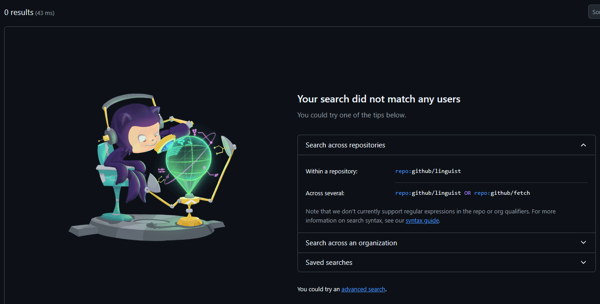

The idea for this project came during bug bounty work on Icelandic companies. One of the first things I always do in recon is search for the target on GitHub and Gists, looking for leaked credentials, API keys, internal URLs, anything useful. But the reality is, interesting stuff almost never comes from just searching the company name.

The company's org account is usually clean. Maybe a few public repos but nothing sensitive. The real gold is usually in the personal accounts of the developers.

But GitHub doesn't let you search users by employer. Some people list their company on GitHub, most don't. And even when we do find someone, GitHub search has a lot of limitations.

Icelandic companies also often have common-word names, so searching for them could return pages of unrelated noise. The search API caps results at around 1,000 per query, so broad searches are incomplete. GitHub's code search only indexes the default branch, so anything committed to a feature branch is invisible. And gist search only looks at the latest revision, not the history.

Now imagine trying to do deeper recon manually across dozens of potential employees, hundreds of repos, thousands of commits. We'd need to go through each user, check each repo, look at non-default branches or closed pull requests, try to find suspicious sounding commit messages ("removed sensitive info lol") in hopes of a clue, check everyone's gists and old revisions and more. It's just not feasible by hand. We could spend days on one company and still miss things.

I wanted to automate all of that. The plan was: identify as many Icelandic GitHub users as I could, collect every line of code they've ever pushed (across all branches, all repos, all gist revisions), and run regex patterns against all of it to find secrets.

If you don't want to listen to my journey in making this or don't care about how this all works, you can jump straight down to the [Results](#results) section.

## How commits work on GitHub (and why you can't hide them)

This is worth understanding because it's central to why this project exists.

When you push a commit to GitHub, that commit object is stored permanently. You can delete the branch, force-push, rebase, whatever. The commit is still there. If you know the SHA, you can access it directly at `https://github.com/<user>/<repo>/commit/<sha>` and read the full diff. It just won't show up directly in the history anymore.

People think rebasing is enough because the commit disappears from the commit log. But it's still there. And the SHA can still be found. Some people don't even bother with a rebase, they just make a new commit that deletes the secret and assume it's fine. But that's git, the previous commit with the secret is still in the history, and on GitHub it's easily found in the commit log.

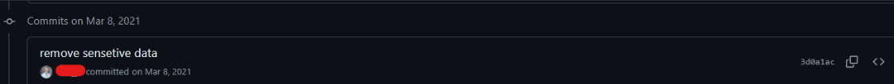

We can find hidden SHAs through GitHub's Events API. Every push to a repository generates a `PushEvent` that includes the SHAs of the commits in that push. The `payload.head` field gives you the SHA of the latest commit. So even after someone rebases away a commit that had a password in it, the PushEvent still has the reference, and we can use it to pull up the full commit.

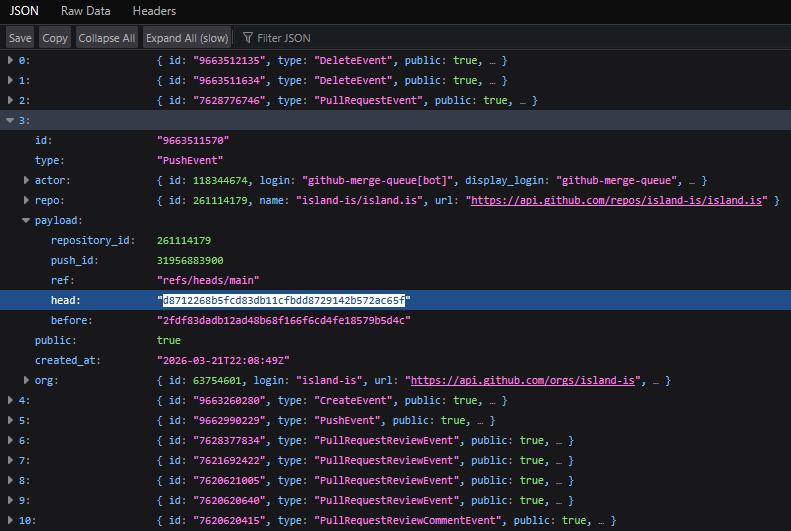

The problem is that the Events API only keeps the last 300 events per repository, and those 300 include all event types (issues, stars, forks, etc.), not just pushes. For any repo with moderate activity, the useful push events disappear fast. We'd need to be polling repositories constantly to catch them before they scroll off.

That's where [GHArchive](https://www.gharchive.org/) comes in. GHArchive stores historical GitHub events going back to February 2011. Every hour of GitHub activity is archived as a compressed JSON file. So instead of trying to catch events before they disappear, we can just download the entire history and extract every PushEvent SHA that was ever recorded.

## The pipeline

A quick note: The point of this writeup is the process and the approach, not this specific codebase. The code in this repo is still a work in progress and I'm not suggesting anyone should try to run this themselves, but feel free to take a look.

The whole thing runs as a Django app with PostgreSQL for structured data, Elasticsearch for full-text code search, and a background task worker. Everything is managed through the Django admin.

We are going to walk every branch of every repo for every Icelandic user, fetch full commit details, pull all gist revisions etc. This adds up fast. GitHub's rate limit is 5,000 requests per hour per token, and that runs out quickly when we're processing thousands of repos, with hundreds or thousands of commits each. Our system supports multiple GitHub personal access tokens and rotates between them automatically when one gets rate limited. If all tokens are exhausted it waits for the earliest one to reset. We basically need a handful of tokens to keep things moving at a reasonable pace.

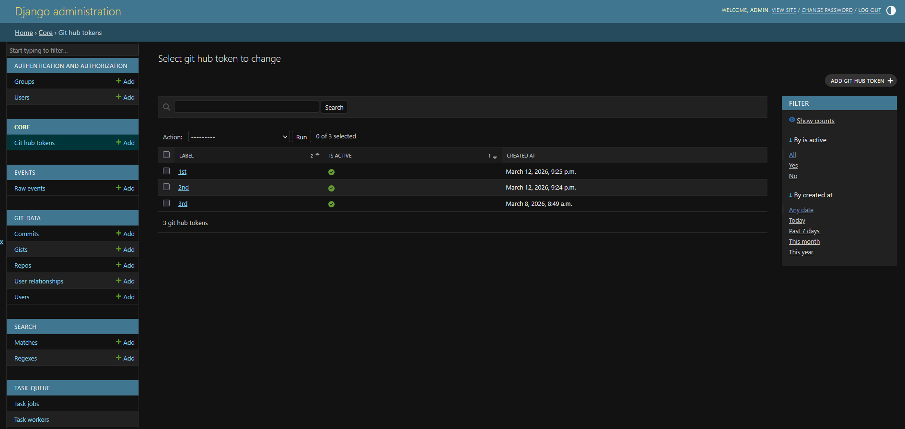

## How we store the data

The database is built around a few core models. At the center is the User. Each user record has their GitHub profile info (username, name, email, company, bio, location), an account type (regular user or organization), a status (Confirmed, Unknown, or Hidden), and a discovery method that tracks how we found them (search, follower, following, org member, collaborator, contributor).

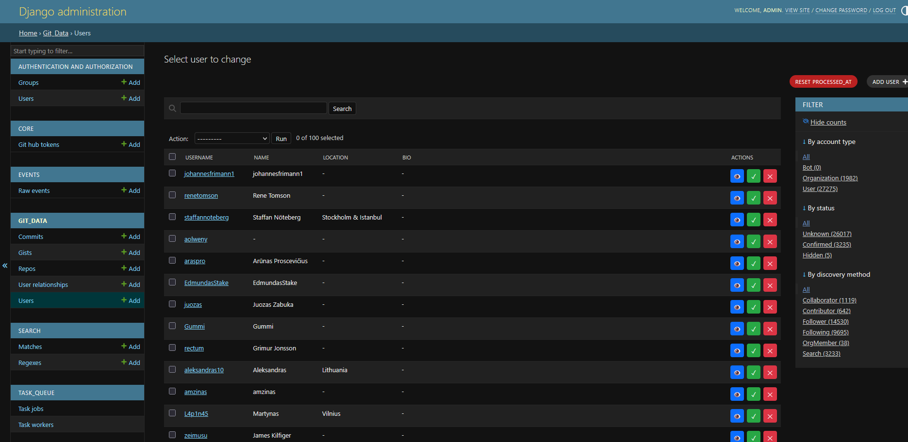

Users are connected to each other through relationships. When we process a user's followers, each follower gets their own user record, and a relationship record links them together with a type (Follower, Following, OrgMember, Collaborator, Contributor). The same person can show up through multiple paths. Maybe they were found as a follower of one confirmed user, then again as an org member of an Icelandic company, then again as a contributor to another confirmed user's repo. All of those relationships are tracked separately, which gives us a pretty complete picture of how the Icelandic GitHub community is connected.

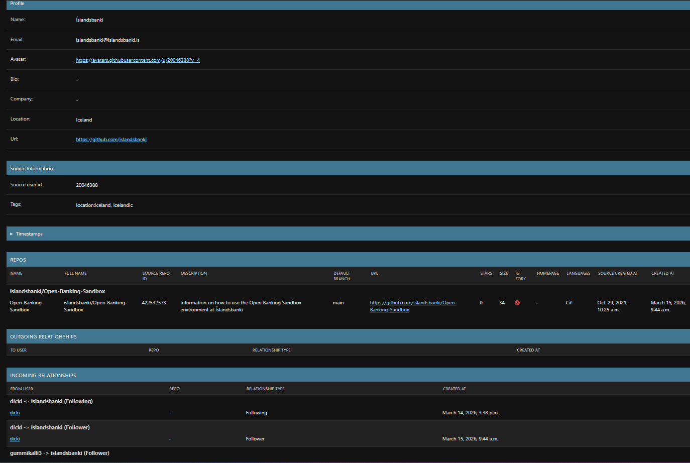

Each user owns Repos, and each repo has Commits. Commits track the SHA, message, author, committer, date, branch, and whether they came from normal branch walking or from GHArchive events. Users also have Gists, and each gist revision is stored as a separate record.

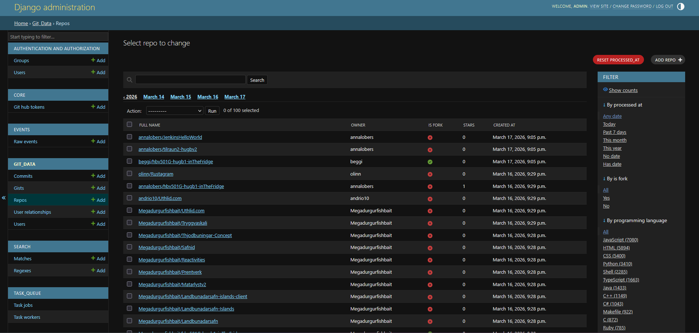

The status field on users is important. When users come in through follower/following discovery, they start as Unknown. Only confirmed users get their repos and gists processed in subsequent tasks, so this keeps the pipeline focused and avoids wasting API calls on random users from other countries who happen to follow someone in Iceland.

This is the biggest manual part. I go through the unknown users in the admin and decide who's Icelandic. I look at names for patterns like -sson or -dóttir, search for Icelandic characters like ð and þ in their bio or name, look for Icelandic first names, check if their location says something useful. It's not perfect and I'll definitely miss some, but it catches a lot of them. I've made this as simple as possible in the admin with confirm/hide buttons right next to each user record so I can go through them quickly.

## How the tasks work

The pipeline is split into separate tasks that each do one specific thing. They're managed through a custom task queue. There's a background worker process that polls for new jobs, picks them up, and runs them. Each task gets its own log file that streams live in the admin so we can track the progress.

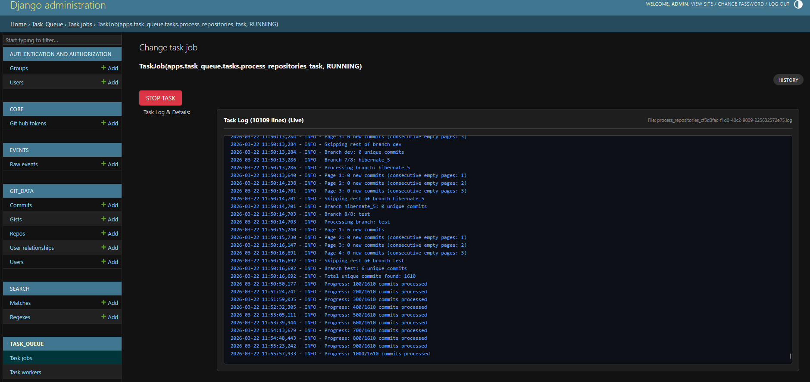

Tasks use a claiming system to support running multiple workers without stepping on each other. When a worker picks up a batch of users or repos to process, it claims them in the database so other workers skip those and grab different ones. Claims get refreshed periodically and released when the task finishes or gets cancelled.

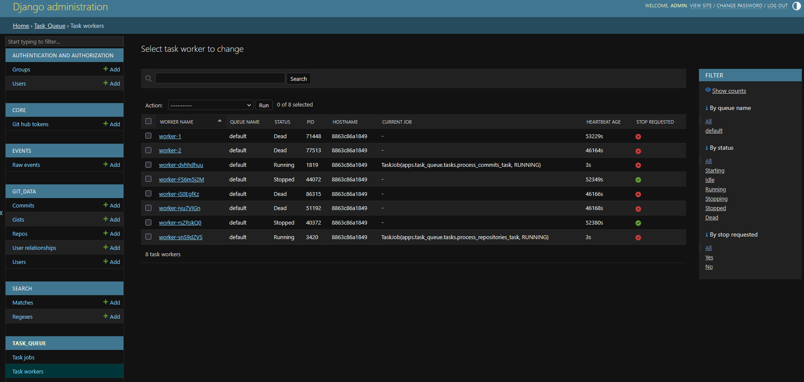

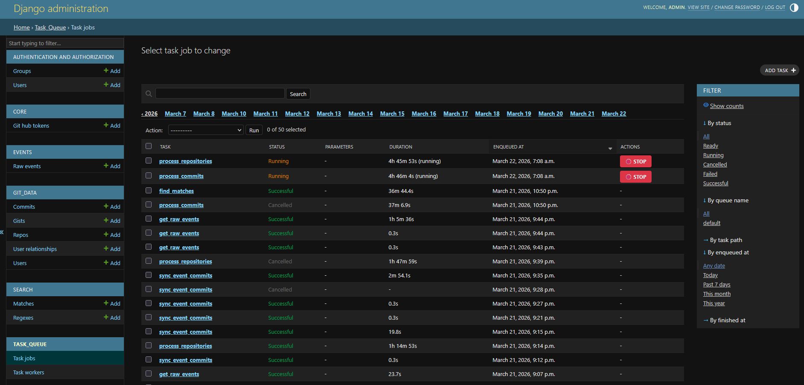

Each model has a `processed_at` field that starts as null. When a task finishes processing a user, repo, commit, or gist, it sets `processed_at` to the current time. On the next run, the task only picks up records where `processed_at` is still null, so we never reprocess the same thing twice. The admin shows how many remain for each task type so I can see where things stand.

Tasks can be stopped mid-run from the admin without losing progress. Whatever has been processed stays processed, and the next run picks up where it left off.

## Steps

### User Discovery

This is our entrypoint. We start with a search like `location:Iceland` or `location:Ísland` or any variation of Icelandic town names. The GitHub search API has a 1,000 result limit per query, so to get around that, we split the query by account creation date. If a date range returns more than 1,000 results it gets split in half recursively until every sub-range fits within the limit. This way we get all the users, not just the first thousand.

Each user gets their full profile fetched and saved: username, name, email, company, bio, location, the works.

### Process Users

Once we have a set of confirmed Icelandic users, this task expands the dataset. For each user it fetches their followers and who they follow. It fetches org members if the account is an organization. It catalogs all their repos and all their gists+revisions.

The followers/following are saved as new users with an "Unknown" status. This is where a lot of discovery happens organically. Icelandic developers tend to follow or collaborate with other Icelandic developers.

### Process Repositories

For each non-fork repo owned by a confirmed user, we list every branch, walk the full commit history of each branch, and save every commit. We also go through pull requests and grab those commits separately. Feature branches are where people tend to be less careful, hardcoding credentials for testing and such.

### Process Gists

For each gist, we fetch the file contents for every revision and compute a diff between consecutive versions. The diffs get indexed into Elasticsearch. The revision history is still there through the API even though search ignores it.

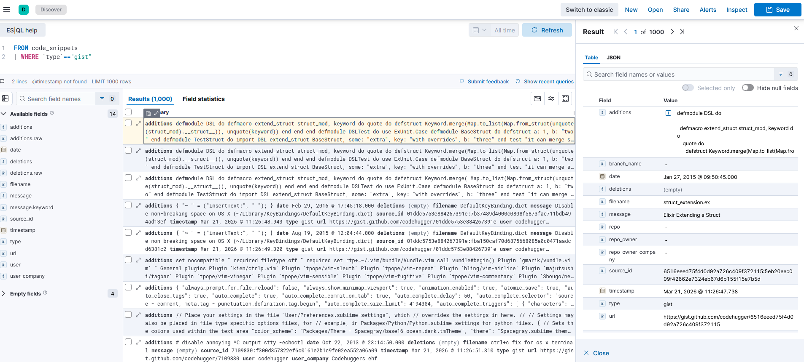

### Process Commits

For every commit that's been saved, this task goes back to GitHub, fetches the full commit details (the actual patch/diff for every file), and indexes each file's additions and deletions into Elasticsearch as separate documents. After this runs, everything is searchable.

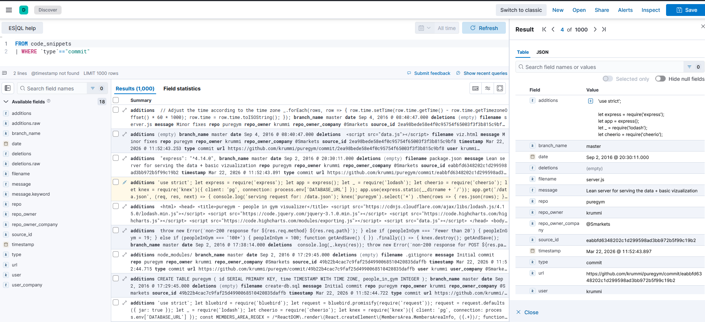

### Find Matches

We can add any number of regex patterns to search for specific stuff like API keys (OpenAI, AWS, GCP, Azure, etc.), private keys, JWTs, database connection strings, cloud credentials, passwords, Icelandic PII patterns like kennitala, or whatever we like.

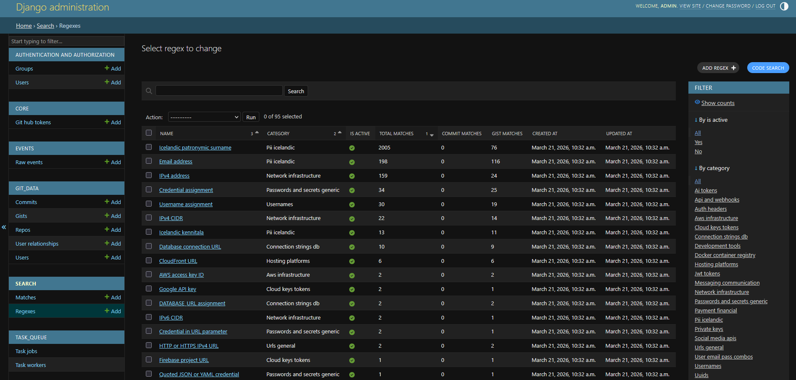

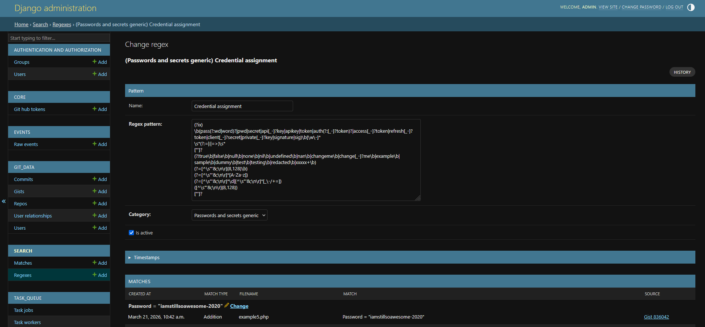

This task runs every active regex against the full Elasticsearch index. For each match it records what was matched, the full line of code, the filename, and resolves it back to the actual commit or gist in the database so we have a direct link to view it on GitHub.

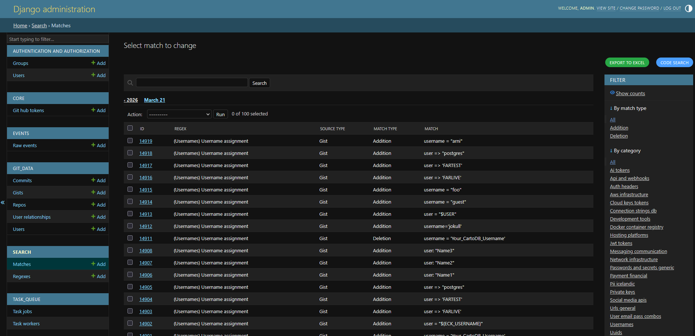

The regexes track their own checkpoint, so on subsequent runs they only scan new documents. If we update a regex pattern, its checkpoint resets and it rescans everything from scratch.

### Get Raw Events (GHArchive)

The full GHArchive dataset is close to 20TB **compressed**. The dataset is fetchable in hourly buckets starting from 2011.
For context: I sampled a random hour of a random day in 2024 and uncompressed, that single hour was a 1GB JSON file.  
Instead of going bankrupt from buying storage space, we stream each compressed file and only look at PushEvents. For each PushEvent we only extract the repo ID and commit SHAs.

Even though we're throwing away 99.9% of each file, this still takes a while and requires hundreds of gigabytes of space. That's why this step is not required, but it might yield something particularly interesting if we are lucky. At the end we have a table of every commit SHA that was ever pushed to any public repo on GitHub, going back to 2011. Most of those aren't interesting, but the ones belonging to our confirmed users' repos might be.

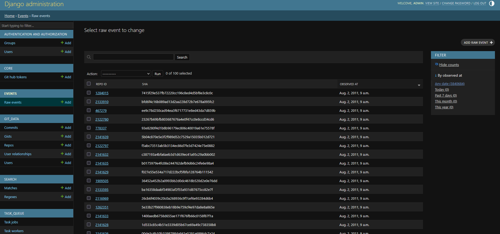

### Sync Event Commits

The final task connects the dots. For each confirmed user's repo that has associated GHArchive events, we take those SHAs and fetch the actual commit data from GitHub. These get flagged as event-sourced commits and enter the traditional pipeline (indexing, regex scanning, etc.).

This is the step that catches rebased or branch-deleted commits.

## Results

At the end of all this, we export the matches to Excel from the Django admin. Each row has the regex category, the matched text, the full line of code, a direct GitHub URL, the user, their company, the repo, and the commit message. 

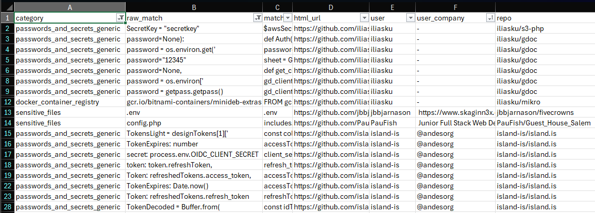

We use Excel because it's easy to filter and sort stuff out of the box so we don't need to build a fancy UI for it. We can filter by category to look at just AWS keys, or filter by company to see everything related to a specific target, or sort by specific user. It's a simple format but it works well for triage.

We can filter by category:

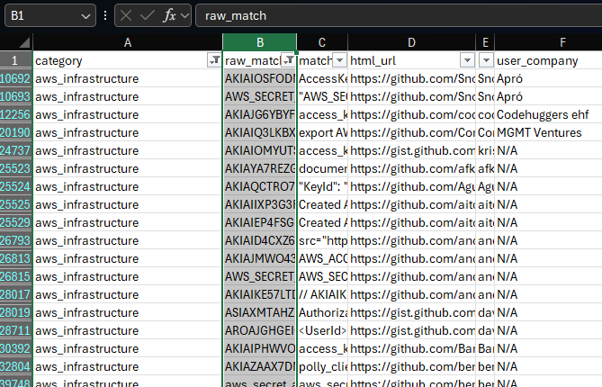

Or company:

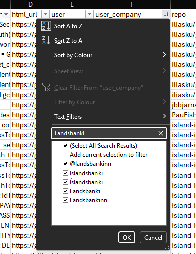

This is also where something like LinkedIn dorking becomes useful. You can Google dork `site:linkedin.com/in "<company name>" developer` and find employees, we can search for those names in our database and see if any of their code had hits. If they are not in the database, we can add them and process.

If we want to search all code additions directly we can use Kibana which is a UI built on top of Elastic Search.

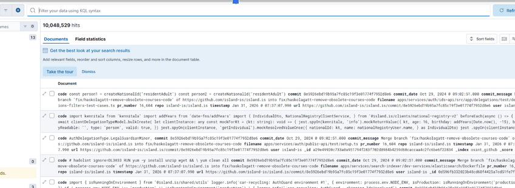

## Wrapping up

This project has gone through a lot of iterations. I've had to nuke the database and start over multiple times, rewrite how I handle rate limiting, rethink what data to keep and how to structure it, add features that turned out to be necessary only after running into problems. GitHub rate limiting was constantly getting in the way early on until I made more GitHub accounts for more tokens to rotate. It's been a lot of trial and error but that's also what made it fun. I never expected to find all Icelandic Github users like this, but I was really surprised by how many users I found relatively fast. I'm already up to almost 7000 users, half from search/half from manual review. 

A lot of the regex matches will end up being false positives, and most of the discovered credentials will probably be revoked. But digging through the dataset is genuinely interesting, and there is definitely a lot of sensitive data in there that users thought they had removed. Looking at user relationships and discovering interesting projects/websites people have worked on has also been a fun side effect of this project. I will most definitely continue adding to my dataset and doing further analysis and research.

If you're doing bug bounty on Icelandic targets, GitHub is worth going deeper than a quick search.